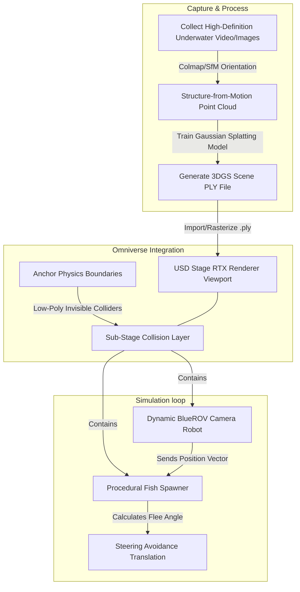

# 3D Gaussian Splatting (3DGS) Underwater Simulation Workflow

This document outlines a modular methodology to run high-fidelity computer vision experiments within photorealistic underwater environments using 3D Gaussian Splatting (3DGS) and NVIDIA Isaac Sim.

---

## 🌊 Pipeline Architecture

The workflow consists of capturing physical structures, rasterizing point clouds, layering collision frameworks, and running robotic cameras alongside physics-deformed spawned fauna.

---

## 🛠️ Step-by-Step Implementation Guide

### 1. Environmental Point Cloud Reconstruction (3DGS Generation)
* Capture steady-cam footage of your target sea trench, reef, or pool environment.
* Extract frames at $2\text{Hz}$ to $5\text{Hz}$ intervals. Ensure substantial sequence overlap ($70\%+$).
* Feed image structures into reconstructors like **Nerfstudio** (`ns-train splatfacto`) or **Luma AI** to produce a dense 3D Gaussian Splatting `.ply` file.

### 2. Rendering inside Omniverse / Isaac Sim
* Open Isaac Sim. The active RTX Real-Time Renderer includes a rasterization pass that interprets `.ply` Gaussians.
* Open the **RTX Gaussian Splatting panel** or drag-and-drop your exported `.ply` file onto the Stage tree. It will serve as your rich background environment.

### 3. Applying Physical Containment Layers (Splat Colliders)
Gaussian Splatting is purely visual; points have no physical volume. To avoid your robot and procedural fish flying off into infinite space:
* Create invisible 3D bounding geometry inside the stage (`Create ➔ Physics ➔ Ground Plane` and `Physics ➔ Box/Sphere Colliders`).
* Group these under `/World/collisions`.
* Set their visibility to `Invisible` (by clicking the eye icon next to the Prims) so they form a hidden physical cage matching the terrain lines of the splat.

### 4. Running the Camera Robot
* Spawn your underwater sensor rig inside the invisible cage.
* Use the built-in camera sensors to train computer vision models (such as detecting whale visual markings). The sensor cameras will capture the visual splatted point cloud backgrounds without performance-heavy real-time mesh calculations.
