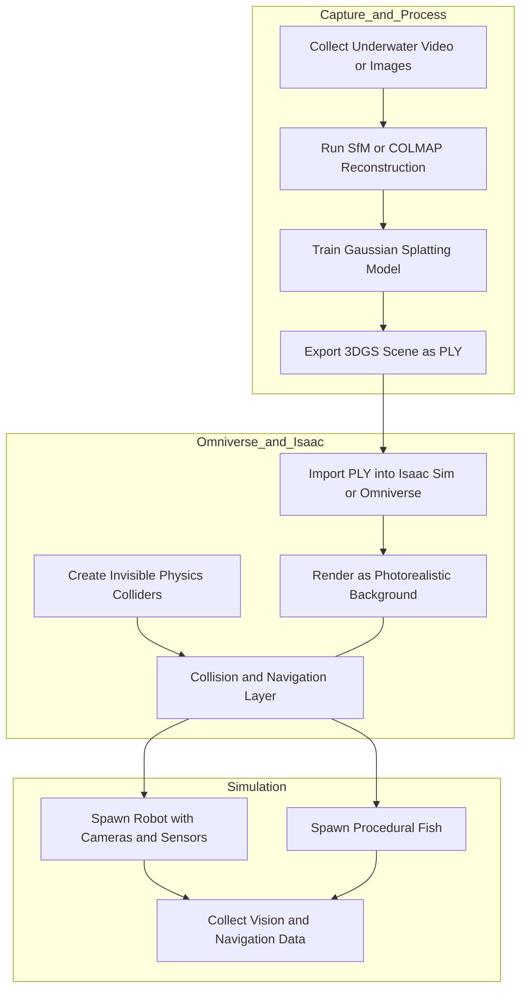

# Gaussian Splatting Workflow Notes

This note captures the typical modular workflow for using 3D Gaussian Splatting environments with Isaac Sim and underwater robotics.

## Workflow Diagram

## Practical Notes

- The splat is mainly visual, so physics usually needs a separate collision layer.
- This works well for camera-based robotics experiments.
- Procedural fish can be added as standard USD actors on top of the splat scene.
