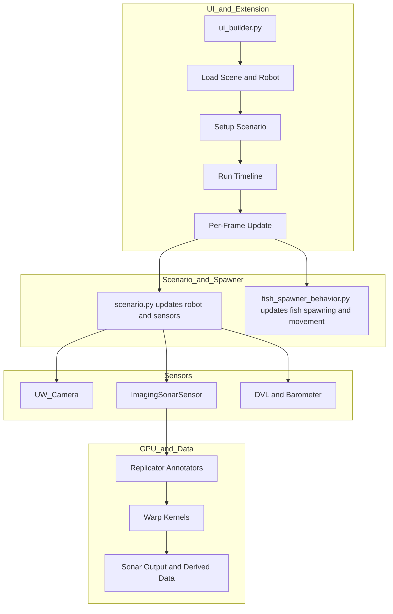
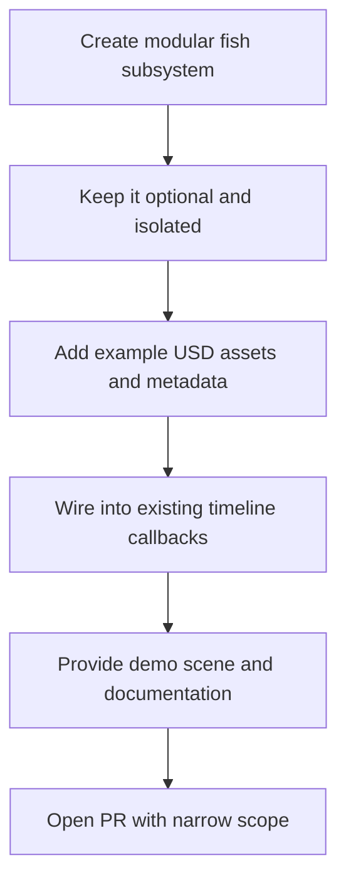

# OceanSim Architecture Notes

This note captures the Mermaid view of how the OceanSim extension is structured inside Isaac Sim.

## Architecture Diagram

## Notes

- `ui_builder.py` is the main orchestration layer for the extension UI and callbacks.
- `scenario.py` owns robot control mode behavior such as waypoints and straight-line movement.
- `fish_spawner_behavior.py` adds dynamic marine life on top of the OceanSim base stack.
- The sonar path is the most GPU-heavy part of the project.

## Where It Could Improve

### Performance Bottlenecks

- The imaging sonar path is the main runtime bottleneck, not the visual background density by itself.
- The extension repeatedly pulls annotator data from Replicator each simulation step, which can introduce GPU-to-CPU synchronization overhead.
- Per-frame Python-driven USD transform updates for dynamic actors can become expensive as the fish count grows.
- The current stack does not appear to batch dynamic fauna updates into a more scalable simulation layer.

### Architectural Gaps

- The project is strong on robot sensors, but it is relatively light on ecological scene dynamics such as schools of fish, predators, or biologically varied moving targets.
- UI flow and runtime lifecycle are serviceable, but reset and reload behavior required extra care when adding dynamic spawned actors and waypoint-driven control.
- Material and scene asset handling are practical, but not especially optimized for large-scale biologically rich environments.

### What Already Looks Strong

- The separation between UI, scenario logic, and sensor implementation is clean.
- The Warp-based sonar processing approach is a serious strength and is closer to best practice than most purely Python sensor prototypes.
- As an underwater Isaac Sim extension, OceanSim is already more structured and more reusable than many one-off research repos.

## Contribution Opportunities

### High-Value Additions

- Dynamic marine life is a meaningful gap in the current repository, so a procedural fish system is a useful contribution rather than a side feature.
- A fish module would make the environment better for detection, tracking, avoidance, and classification experiments.
- Marked whales, schooling fish, and behavior-driven spawning are especially relevant for camera-based robotics research.

### Good Contribution Shape

- Keep the fish system modular and optional.
- Avoid coupling fish spawning to the sensor stack directly.
- Treat fish as a separate simulation subsystem that plugs into the existing timeline and scenario callbacks.
- Ship example assets, example scenes, and a simple enable or disable toggle so maintainers can test it quickly.

### Practical Contribution Plan

## Is OceanSim The Right Base?

- For underwater robotics in Isaac Sim, yes, it is a reasonable base for your work.
- It already gives you robot loading, scenario control, sensor hooks, and an Isaac Sim extension structure.
- If your main interest is underwater perception with moving animals, extending OceanSim is likely faster than starting a new extension from scratch.
- If your future work shifts heavily toward large-scale synthetic marine ecosystems, multi-agent simulation, or very high actor counts, you may eventually outgrow parts of the current Python-heavy runtime path.

## Repository Relevance

- A repository with 62 forks is not huge in general open-source terms, but it is meaningful for a niche Isaac Sim underwater robotics extension.
- That level of attention suggests it is relevant and discoverable, especially if it was recently highlighted by the Isaac Sim team.
- It is likely one of the more visible open-source starting points in this exact niche.

## Suggested Contribution Positioning

- Position the fish work as support for underwater perception, tracking, and dynamic-scene benchmarking.
- Emphasize that it improves realism for camera and sonar experiments without replacing the repository's robotics focus.
- Keep the initial pull request narrow: spawning, movement, avoidance, and a small example asset set.
- Follow with later pull requests for schooling, predator-prey behaviors, and richer ecological controls if maintainers are interested.
